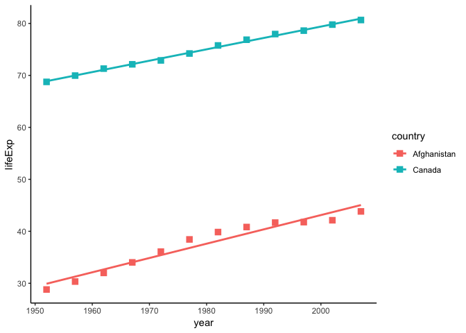
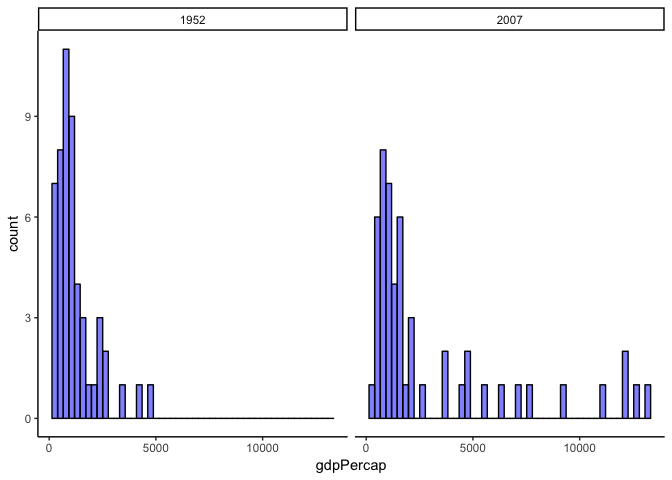
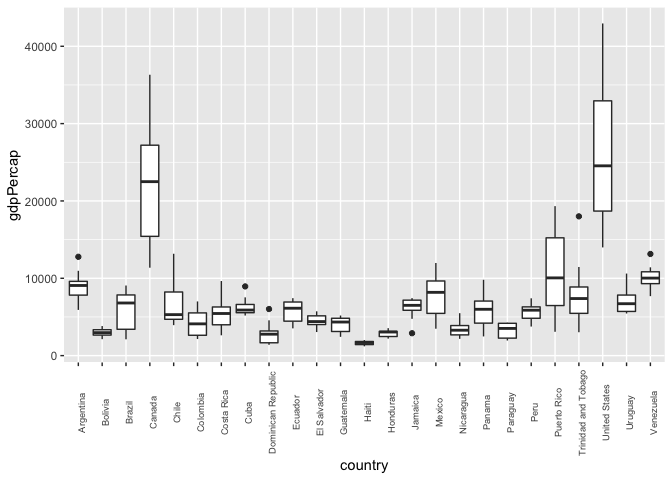
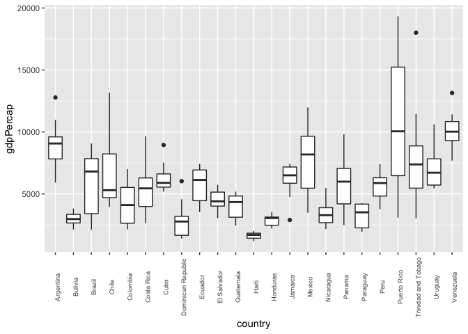

STAT545\_hw02\_exploration
================

``` r
library(gapminder)
library(tidyverse)
```

    ## ── Attaching packages ────────────────────────────────────────────────────────── tidyverse 1.2.1 ──

    ## ✔ ggplot2 3.0.0     ✔ purrr   0.2.5
    ## ✔ tibble  1.4.2     ✔ dplyr   0.7.6
    ## ✔ tidyr   0.8.1     ✔ stringr 1.3.1
    ## ✔ readr   1.1.1     ✔ forcats 0.3.0

    ## ── Conflicts ───────────────────────────────────────────────────────────── tidyverse_conflicts() ──
    ## ✖ dplyr::filter() masks stats::filter()
    ## ✖ dplyr::lag()    masks stats::lag()

# STAT 545 HW02 Data Exploration

## Smell test the data

### What is the gapminder object?

``` r
typeof(gapminder) #returns how R uses object internally
```

    ## [1] "list"

### What is its class?

``` r
class(gapminder) #returns class of object i.e. how data is stored
```

    ## [1] "tbl_df"     "tbl"        "data.frame"

### How many variables/columns?

``` r
ncol(gapminder) #counts number of columns
```

    ## [1] 6

### How many rows/observations?

``` r
nrow(gapminder) #counts number of rows
```

    ## [1] 1704

### Can you get these facts about “extent” or “size” in more than one way? Can you imagine different functions being useful in different contexts?

``` r
dim(gapminder) #counts number of rows then columns i.e. dimensions of a 2D matrix
```

    ## [1] 1704    6

*nrow* and *ncol* functions could be useful for creating loops that
require the number of rows or columns. *dim* function could be useful
for matrix
calculations.

### What data type is each variable?

``` r
sapply(gapminder, class) #returns data types of each variable in the object
```

    ##   country continent      year   lifeExp       pop gdpPercap 
    ##  "factor"  "factor" "integer" "numeric" "integer" "numeric"

## Explore individual variables

### What are possible values (or range, whichever is appropriate) of each variable?

Let’s explore two quantitative variables, *year* \(_integer_\) and
*lifeExp* \(_numeric_\), and one categorical variable, *continent*
\(_factor_\)

``` r
range(gapminder$year) #returns minimum and maximum values of variable in the object
```

    ## [1] 1952 2007

``` r
range(gapminder$lifeExp)
```

    ## [1] 23.599 82.603

``` r
table(gapminder$continent) #continent is a categorical variable, so table() will list possible values 
```

    ## 
    ##   Africa Americas     Asia   Europe  Oceania 
    ##      624      300      396      360       24

What values are typical? What’s the spread? What’s the distribution?
Etc., tailored to the variable at hand.

``` r
summary(gapminder$year) #returns statistical summary
```

    ##    Min. 1st Qu.  Median    Mean 3rd Qu.    Max. 
    ##    1952    1966    1980    1980    1993    2007

``` r
summary(gapminder$lifeExp)
```

    ##    Min. 1st Qu.  Median    Mean 3rd Qu.    Max. 
    ##   23.60   48.20   60.71   59.47   70.85   82.60

``` r
summary(gapminder$continent) #for cateogrical variable, returns output similar to table()
```

    ##   Africa Americas     Asia   Europe  Oceania 
    ##      624      300      396      360       24

## Explore various plot types

### A scatterplot of two quantitative variables.

I will compare the life expectancy over time of Afghanistan and Canada:

``` r
filter(gapminder, country == "Afghanistan" | country == "Canada") %>% 
ggplot(aes(year,lifeExp)) +
  geom_point(aes(colour = country), size = 3, shape = 15) + #colour each country distinctly, and give all points custom size and shape
  geom_smooth(method = "lm", se = FALSE, aes(colour = country)) + #linear regression without default confidence interval shading
  theme_classic() #change the look of the plot
```

<!-- -->

Note that life expectancy in both countries increased over time, but
Canada has a signficantly higher life expectancy than Afghanistan.

## A plot of one quantitative variable.

I will find the spread of GDP per capita in Africa in 1952 and 2007
(chronologically, the earliest and most recent data contained in
*gapminder*)

``` r
filter(gapminder, continent == "Africa" & (year == 2007 | year == 1952)) %>% 
  ggplot(aes(gdpPercap)) +
  geom_histogram(bins = 50, colour = "black", fill = "blue", alpha = .5) + #distribute over custom bin number, customize colour and fill, and give some transparency for visual appeal
  facet_grid(~year) + #create multiple plots by year
  theme_classic()
```

<!-- -->

Here we see that in 1952, all of of Africa had GDP per capita lower than
$5,000. 55 years later, the majority of Africa still has GDP per capita
lower than $5,000, but now with significant portions between
$5,000-10,000 and some above $10,000.

## A plot of one quantitative variable and one categorical.

I will plot the 5-number statistical summary of GDP per capita of
countries in the Americas.

``` r
filter(gapminder, continent == "Americas") %>% 
  ggplot(aes(country, gdpPercap)) +
  geom_boxplot() +
  theme(axis.text.x  = element_text(angle=90, vjust=1, size=7)) #customize x-axis labelling for readability
```

<!-- -->

Not suprisingly, US and Canada have the highest GDP per capita. Let’s
take a look at the above plot without US and Canada so we can explore
the rest of the Americas with better
resolution.

``` r
filter(gapminder, continent == "Americas" & country != "Canada" & country != "United States") %>%
  # exclude Canada and United States with the filter
  ggplot(aes(country, gdpPercap)) +
  geom_boxplot() +
  theme(axis.text.x  = element_text(angle=90, vjust=1, size=7))
```

<!-- -->

## But I want to do more\!

### An analyst intended to filter *gapminder* data into the entries for the two countries, Afghanistan and Rwanda, by using the following code chunk:

``` r
filter(gapminder, country == c("Rwanda", "Afghanistan"))
```

    ## # A tibble: 12 x 6
    ##    country     continent  year lifeExp      pop gdpPercap
    ##    <fct>       <fct>     <int>   <dbl>    <int>     <dbl>
    ##  1 Afghanistan Asia       1957    30.3  9240934      821.
    ##  2 Afghanistan Asia       1967    34.0 11537966      836.
    ##  3 Afghanistan Asia       1977    38.4 14880372      786.
    ##  4 Afghanistan Asia       1987    40.8 13867957      852.
    ##  5 Afghanistan Asia       1997    41.8 22227415      635.
    ##  6 Afghanistan Asia       2007    43.8 31889923      975.
    ##  7 Rwanda      Africa     1952    40    2534927      493.
    ##  8 Rwanda      Africa     1962    43    3051242      597.
    ##  9 Rwanda      Africa     1972    44.6  3992121      591.
    ## 10 Rwanda      Africa     1982    46.2  5507565      882.
    ## 11 Rwanda      Africa     1992    23.6  7290203      737.
    ## 12 Rwanda      Africa     2002    43.4  7852401      786.

By using the c() function, R combined the entries into a vector of the
same size as one country’s entries. In this case, the function seems to
have split them along the year column, XXX2 dates from Rwanda and XXX7
dates from Afghanistan, so half of the entries being from each.

One way to achieve the intended result would have been by filtering for
Rwanda entries and filtering for Afghanistan entries.

``` r
filter(gapminder, country == "Rwanda" | country == "Afghanistan")
```

    ## # A tibble: 24 x 6
    ##    country     continent  year lifeExp      pop gdpPercap
    ##    <fct>       <fct>     <int>   <dbl>    <int>     <dbl>
    ##  1 Afghanistan Asia       1952    28.8  8425333      779.
    ##  2 Afghanistan Asia       1957    30.3  9240934      821.
    ##  3 Afghanistan Asia       1962    32.0 10267083      853.
    ##  4 Afghanistan Asia       1967    34.0 11537966      836.
    ##  5 Afghanistan Asia       1972    36.1 13079460      740.
    ##  6 Afghanistan Asia       1977    38.4 14880372      786.
    ##  7 Afghanistan Asia       1982    39.9 12881816      978.
    ##  8 Afghanistan Asia       1987    40.8 13867957      852.
    ##  9 Afghanistan Asia       1992    41.7 16317921      649.
    ## 10 Afghanistan Asia       1997    41.8 22227415      635.
    ## # ... with 14 more rows

## Here are some additional *dplyr* functions and use of *knitr* to make a simple table.

``` r
filter(gapminder, year == 2007) %>% 
  arrange(desc(gdpPercap)) %>% 
  select(country, lifeExp, pop, gdpPercap) %>% 
  knitr::kable(digits = 0,caption = "Table 1: Countries ranked by GDP per capita [2007].")
```

| country                  | lifeExp |        pop | gdpPercap |
| :----------------------- | ------: | ---------: | --------: |
| Norway                   |      80 |    4627926 |     49357 |
| Kuwait                   |      78 |    2505559 |     47307 |
| Singapore                |      80 |    4553009 |     47143 |
| United States            |      78 |  301139947 |     42952 |
| Ireland                  |      79 |    4109086 |     40676 |
| Hong Kong, China         |      82 |    6980412 |     39725 |
| Switzerland              |      82 |    7554661 |     37506 |
| Netherlands              |      80 |   16570613 |     36798 |
| Canada                   |      81 |   33390141 |     36319 |
| Iceland                  |      82 |     301931 |     36181 |
| Austria                  |      80 |    8199783 |     36126 |
| Denmark                  |      78 |    5468120 |     35278 |
| Australia                |      81 |   20434176 |     34435 |
| Sweden                   |      81 |    9031088 |     33860 |
| Belgium                  |      79 |   10392226 |     33693 |
| Finland                  |      79 |    5238460 |     33207 |
| United Kingdom           |      79 |   60776238 |     33203 |
| Germany                  |      79 |   82400996 |     32170 |
| Japan                    |      83 |  127467972 |     31656 |
| France                   |      81 |   61083916 |     30470 |
| Bahrain                  |      76 |     708573 |     29796 |
| Spain                    |      81 |   40448191 |     28821 |
| Taiwan                   |      78 |   23174294 |     28718 |
| Italy                    |      81 |   58147733 |     28570 |
| Greece                   |      79 |   10706290 |     27538 |
| Slovenia                 |      78 |    2009245 |     25768 |
| Israel                   |      81 |    6426679 |     25523 |
| New Zealand              |      80 |    4115771 |     25185 |
| Korea, Rep.              |      79 |   49044790 |     23348 |
| Czech Republic           |      76 |   10228744 |     22833 |
| Oman                     |      76 |    3204897 |     22316 |
| Saudi Arabia             |      73 |   27601038 |     21655 |
| Portugal                 |      78 |   10642836 |     20510 |
| Puerto Rico              |      79 |    3942491 |     19329 |
| Slovak Republic          |      75 |    5447502 |     18678 |
| Hungary                  |      73 |    9956108 |     18009 |
| Trinidad and Tobago      |      70 |    1056608 |     18009 |
| Poland                   |      76 |   38518241 |     15390 |
| Croatia                  |      76 |    4493312 |     14619 |
| Gabon                    |      57 |    1454867 |     13206 |
| Chile                    |      79 |   16284741 |     13172 |
| Argentina                |      75 |   40301927 |     12779 |
| Botswana                 |      51 |    1639131 |     12570 |
| Malaysia                 |      74 |   24821286 |     12452 |
| Equatorial Guinea        |      52 |     551201 |     12154 |
| Libya                    |      74 |    6036914 |     12057 |
| Mexico                   |      76 |  108700891 |     11978 |
| Iran                     |      71 |   69453570 |     11606 |
| Venezuela                |      74 |   26084662 |     11416 |
| Mauritius                |      73 |    1250882 |     10957 |
| Romania                  |      72 |   22276056 |     10808 |
| Bulgaria                 |      73 |    7322858 |     10681 |
| Uruguay                  |      76 |    3447496 |     10611 |
| Lebanon                  |      72 |    3921278 |     10461 |
| Panama                   |      76 |    3242173 |      9809 |
| Serbia                   |      74 |   10150265 |      9787 |
| Costa Rica               |      79 |    4133884 |      9645 |
| South Africa             |      49 |   43997828 |      9270 |
| Montenegro               |      75 |     684736 |      9254 |
| Brazil                   |      72 |  190010647 |      9066 |
| Cuba                     |      78 |   11416987 |      8948 |
| Turkey                   |      72 |   71158647 |      8458 |
| Reunion                  |      76 |     798094 |      7670 |
| Thailand                 |      71 |   65068149 |      7458 |
| Bosnia and Herzegovina   |      75 |    4552198 |      7446 |
| Peru                     |      71 |   28674757 |      7409 |
| Jamaica                  |      73 |    2780132 |      7321 |
| Tunisia                  |      74 |   10276158 |      7093 |
| Colombia                 |      73 |   44227550 |      7007 |
| Ecuador                  |      75 |   13755680 |      6873 |
| Algeria                  |      72 |   33333216 |      6223 |
| Dominican Republic       |      72 |    9319622 |      6025 |
| Albania                  |      76 |    3600523 |      5937 |
| El Salvador              |      72 |    6939688 |      5728 |
| Egypt                    |      71 |   80264543 |      5581 |
| Guatemala                |      70 |   12572928 |      5186 |
| China                    |      73 | 1318683096 |      4959 |
| Namibia                  |      53 |    2055080 |      4811 |
| Angola                   |      43 |   12420476 |      4797 |
| Jordan                   |      73 |    6053193 |      4519 |
| Swaziland                |      40 |    1133066 |      4513 |
| Iraq                     |      60 |   27499638 |      4471 |
| Syria                    |      74 |   19314747 |      4185 |
| Paraguay                 |      72 |    6667147 |      4173 |
| Sri Lanka                |      72 |   20378239 |      3970 |
| Bolivia                  |      66 |    9119152 |      3822 |
| Morocco                  |      71 |   33757175 |      3820 |
| Congo, Rep.              |      55 |    3800610 |      3633 |
| Honduras                 |      70 |    7483763 |      3548 |
| Indonesia                |      71 |  223547000 |      3541 |
| Philippines              |      72 |   91077287 |      3190 |
| Mongolia                 |      67 |    2874127 |      3096 |
| West Bank and Gaza       |      73 |    4018332 |      3025 |
| Nicaragua                |      73 |    5675356 |      2749 |
| Pakistan                 |      65 |  169270617 |      2606 |
| Sudan                    |      59 |   42292929 |      2602 |
| India                    |      65 | 1110396331 |      2452 |
| Vietnam                  |      74 |   85262356 |      2442 |
| Yemen, Rep.              |      63 |   22211743 |      2281 |
| Djibouti                 |      55 |     496374 |      2082 |
| Cameroon                 |      50 |   17696293 |      2042 |
| Nigeria                  |      47 |  135031164 |      2014 |
| Mauritania               |      64 |    3270065 |      1803 |
| Cambodia                 |      60 |   14131858 |      1714 |
| Senegal                  |      63 |   12267493 |      1712 |
| Chad                     |      51 |   10238807 |      1704 |
| Sao Tome and Principe    |      66 |     199579 |      1598 |
| Korea, Dem. Rep.         |      67 |   23301725 |      1593 |
| Lesotho                  |      43 |    2012649 |      1569 |
| Cote d’Ivoire            |      48 |   18013409 |      1545 |
| Kenya                    |      54 |   35610177 |      1463 |
| Benin                    |      57 |    8078314 |      1441 |
| Bangladesh               |      64 |  150448339 |      1391 |
| Ghana                    |      60 |   22873338 |      1328 |
| Zambia                   |      42 |   11746035 |      1271 |
| Burkina Faso             |      52 |   14326203 |      1217 |
| Haiti                    |      61 |    8502814 |      1202 |
| Tanzania                 |      53 |   38139640 |      1107 |
| Nepal                    |      64 |   28901790 |      1091 |
| Uganda                   |      52 |   29170398 |      1056 |
| Madagascar               |      59 |   19167654 |      1045 |
| Mali                     |      54 |   12031795 |      1043 |
| Comoros                  |      65 |     710960 |       986 |
| Afghanistan              |      44 |   31889923 |       975 |
| Myanmar                  |      62 |   47761980 |       944 |
| Guinea                   |      56 |    9947814 |       943 |
| Somalia                  |      48 |    9118773 |       926 |
| Togo                     |      58 |    5701579 |       883 |
| Rwanda                   |      46 |    8860588 |       863 |
| Sierra Leone             |      43 |    6144562 |       863 |
| Mozambique               |      42 |   19951656 |       824 |
| Malawi                   |      48 |   13327079 |       759 |
| Gambia                   |      59 |    1688359 |       753 |
| Central African Republic |      45 |    4369038 |       706 |
| Ethiopia                 |      53 |   76511887 |       691 |
| Eritrea                  |      58 |    4906585 |       641 |
| Niger                    |      57 |   12894865 |       620 |
| Guinea-Bissau            |      46 |    1472041 |       579 |
| Zimbabwe                 |      43 |   12311143 |       470 |
| Burundi                  |      50 |    8390505 |       430 |
| Liberia                  |      46 |    3193942 |       415 |
| Congo, Dem. Rep.         |      46 |   64606759 |       278 |

Table 1: Countries ranked by GDP per capita \[2007\].

#### End of file
