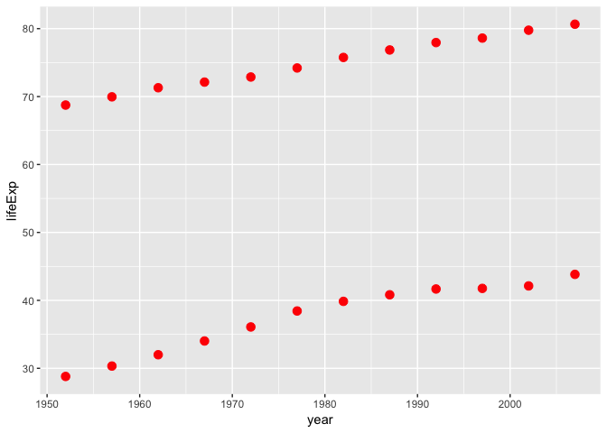
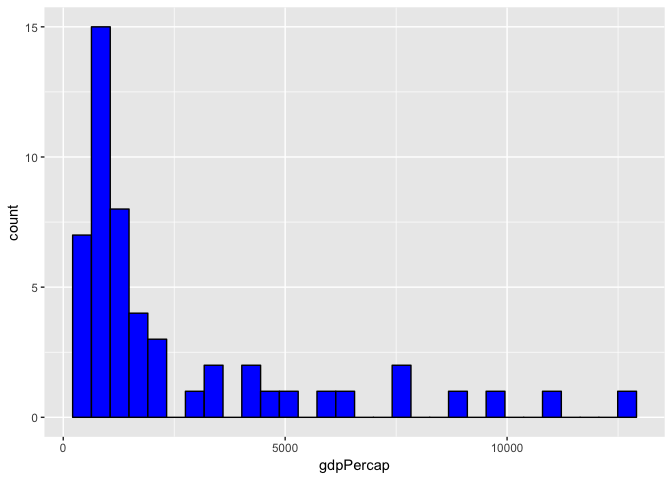
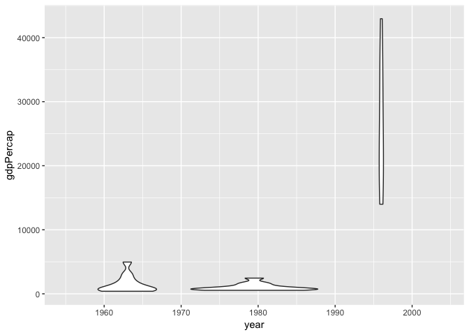

STAT545\_hw02\_exploration
================

``` r
library(gapminder)
library(tidyverse)
```

    ## ── Attaching packages ────────────────────────────────────────────────────────── tidyverse 1.2.1 ──

    ## ✔ ggplot2 3.0.0     ✔ purrr   0.2.5
    ## ✔ tibble  1.4.2     ✔ dplyr   0.7.6
    ## ✔ tidyr   0.8.1     ✔ stringr 1.3.1
    ## ✔ readr   1.1.1     ✔ forcats 0.3.0

    ## ── Conflicts ───────────────────────────────────────────────────────────── tidyverse_conflicts() ──
    ## ✖ dplyr::filter() masks stats::filter()
    ## ✖ dplyr::lag()    masks stats::lag()

# Smell test the data

What is the gapminder object?

``` r
typeof(gapminder)
```

    ## [1] "list"

What is its class?

``` r
class(gapminder)
```

    ## [1] "tbl_df"     "tbl"        "data.frame"

How many variables/columns?

``` r
ncol(gapminder)
```

    ## [1] 6

How many rows/observations?

``` r
nrow(gapminder)
```

    ## [1] 1704

Can you get these facts about “extent” or “size” in more than one way?
Can you imagine different functions being useful in different contexts?

``` r
dim(gapminder)
```

    ## [1] 1704    6

nrow and ncol functions could be useful if creating loops that require
the number of rows or columns. dim function could be useful for matrix
calculations

What data type is each variable?

``` r
sapply(gapminder, class)
```

    ##   country continent      year   lifeExp       pop gdpPercap 
    ##  "factor"  "factor" "integer" "numeric" "integer" "numeric"

# Explore individual variables

What are possible values (or range, whichever is appropriate) of each
variable?

``` r
range(gapminder$year)
```

    ## [1] 1952 2007

``` r
range(gapminder$lifeExp)
```

    ## [1] 23.599 82.603

``` r
table(gapminder$continent)
```

    ## 
    ##   Africa Americas     Asia   Europe  Oceania 
    ##      624      300      396      360       24

What values are typical? What’s the spread? What’s the distribution?
Etc., tailored to the variable at hand.

``` r
summary(gapminder$year)
```

    ##    Min. 1st Qu.  Median    Mean 3rd Qu.    Max. 
    ##    1952    1966    1980    1980    1993    2007

``` r
summary(gapminder$lifeExp)
```

    ##    Min. 1st Qu.  Median    Mean 3rd Qu.    Max. 
    ##   23.60   48.20   60.71   59.47   70.85   82.60

``` r
summary(gapminder$continent)
```

    ##   Africa Americas     Asia   Europe  Oceania 
    ##      624      300      396      360       24

Feel free to use summary stats, tables, figures. We’re NOT expecting
high production value (yet).

# Explore various plot types

Make a few plots, probably of the same variable you chose to
characterize numerically. You can use the plot types we went over in
class (cm006) to get an idea of what you’d like to make. Try to explore
more than one plot type. Just as an example of what I mean:

A scatterplot of two quantitative variables.

``` r
filter(gapminder, country == "Afghanistan" | country == "Canada") %>% 
ggplot(aes(year, lifeExp)) +
  geom_point(colour = "red", size = 3)
```

<!-- -->

A plot of one quantitative variable. Maybe a histogram or densityplot or
frequency polygon.

``` r
filter(gapminder, continent == "Africa" & year == 2002) %>% 
  ggplot(aes(gdpPercap)) +
  geom_histogram(bins = 30, colour = "black", fill = "blue")
```

<!-- -->

A plot of one quantitative variable and one categorical. Maybe boxplots
for several continents or
countries.

``` r
filter(gapminder, country == "United States" | country == "China" | country == "India") %>% 
  ggplot(aes(group = country, year, gdpPercap)) +
  geom_violin()
```

<!-- -->
